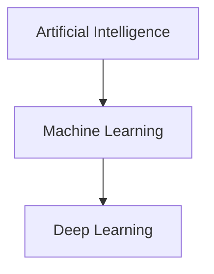

# Machine Learning là gì? So sánh với AI và Deep Learning

## 1. Định nghĩa

### Artificial Intelligence (AI)
- **Là gì**: Lĩnh vực rộng nhất về máy móc mô phỏng trí thông minh con người
- **Đặc điểm**:
  - Bao gồm cả hệ thống rule-based và học máy
  - Ví dụ: Hệ thống expert, chatbot đơn giản, robot công nghiệp

### Machine Learning (ML)
- **Là gì**: Tập con của AI, tập trung vào việc máy "học" từ dữ liệu
- **Đặc điểm**:
  - Không cần lập trình tường minh
  - Tự động cải thiện qua kinh nghiệm
  - Ví dụ: Dự đoán giá nhà, phân loại email spam

### Deep Learning (DL)
- **Là gì**: Tập con của ML sử dụng mạng neural nhiều lớp
- **Đặc điểm**:
  - Tự động trích xuất đặc trưng từ dữ liệu thô
  - Hiệu quả với dữ liệu phi cấu trúc
  - Ví dụ: Nhận diện khuôn mặt, dịch tự động

## 2. So sánh chi tiết

| Tiêu chí        | AI                | Machine Learning       | Deep Learning          |
|----------------|------------------|-----------------------|-----------------------|
| **Phạm vi**    | Rộng nhất        | Tập con của AI        | Tập con của ML        |
| **Dữ liệu**    | Linh hoạt        | Cần dữ liệu có nhãn  | Cần lượng dữ liệu rất lớn |
| **Tính toán**  | Đa dạng          | CPU thường đủ        | Cần GPU/TPU          |
| **Ví dụ**      | Hệ thống expert | Random Forest        | Mạng CNN             |

## 3. Mối quan hệ


## 4. Khi nào sử dụng?

### **Nên dùng Machine Learning khi:**
-  Dữ liệu có cấu trúc dạng bảng (tabular data)
-  Yêu cầu tốc độ xử lý nhanh
-  Cần giải thích được kết quả (model interpretability)
-  Tài nguyên tính toán hạn chế (chạy tốt trên CPU)

**Ví dụ:**  
 - Dự đoán doanh số bán hàng  
 - Phân loại rủi ro tín dụng  
 - Hệ thống gợi ý sản phẩm đơn giản  

###  **Nên dùng Deep Learning khi:**
-  Dữ liệu phi cấu trúc (ảnh, văn bản, âm thanh)
-  Bài toán phức tạp cần trích xuất đặc trưng tự động
-  Có đủ GPU/TPU và dữ liệu lớn (>100k mẫu)
-  Không yêu cầu giải thích chi tiết mô hình

**Ví dụ:**  
- Nhận diện khối u từ ảnh MRI  
- Dịch máy đa ngôn ngữ  
- Tạo văn bản tự động như ChatGPT  

###  **Không nên dùng ML/DL khi:**
-  Logic đơn giản có thể mô tả bằng if-else
-  Dữ liệu quá ít (<1k mẫu)
-  Yêu cầu real-time trên thiết bị edge (cân nhắc rule-based)

---

## 5. Ví dụ ứng dụng thực tế

###  **Lĩnh vực Y tế**
| Công nghệ | Ứng dụng cụ thể | Mô hình điển hình |
|-----------|----------------|------------------|
| **AI** | Hệ thống hỏi đáp triệu chứng | Rule-based chatbot |
| **ML** | Chẩn đoán bệnh tiểu đường | Random Forest/XGBoost |
| **DL** | Phát hiện ung thư từ ảnh X-quang | Mạng CNN (ResNet, DenseNet) |

###  **Lĩnh vực Tài chính**
| Công nghệ | Ứng dụng | Công cụ |
|-----------|---------|--------|
| **AI** | Trợ lý ảo tư vấn đầu tư | Kết hợp NLP + rule |
| **ML** | Phát hiện gian lận thẻ tín dụng | Isolation Forest |
| **DL** | Phân tích sentiment báo cáo tài chính | Transformer (BERT) |

###  **Lĩnh vực Bán lẻ**

## Tóm lại
- AI là khái niệm rộng bao trùm
- ML phù hợp cho dữ liệu có cấu trúc
- DL vượt trội với dữ liệu phi cấu trúc
- Luôn đánh đổi giữa độ chính xác và tài nguyên
# Các loại biến dữ liệu (Data Variables)

## 1. Biến phân loại (Categorical Variables)
- **Định nghĩa**: Biến thể hiện thuộc tính/loại không có thứ tự
- **Đặc điểm**:
  - Giá trị rời rạc (discrete)
  - Không thể thực hiện phép toán số học
- **Phân loại**:
  - **Nominal**: Không có thứ tự
    - Ví dụ: Màu sắc (đỏ, xanh, vàng), Loại phương tiện (xe máy, ô tô, xe bus)
  - **Binary**: Trường hợp đặc biệt chỉ có 2 giá trị
    - Ví dụ: Giới tính (Nam/Nữ), Có/Không

## 2. Biến số học (Numerical Variables)
- **Định nghĩa**: Biến có giá trị số, có thể đo lường
- **Đặc điểm**:
  - Có thể thực hiện phép toán (+, -, ×, ÷)
  - Khoảng cách giữa các giá trị có ý nghĩa
- **Phân loại**:
  - **Continuous (Liên tục)**:
    - Nhận bất kỳ giá trị nào trong khoảng
    - Ví dụ: Chiều cao (1.75m), Nhiệt độ (36.5°C)
  - **Discrete (Rời rạc)**:
    - Giá trị nguyên đếm được
    - Ví dụ: Số phòng trong nhà (3 phòng), Số lần truy cập website

## 3. Biến thứ tự (Ordinal Variables)
- **Định nghĩa**: Biến phân loại CÓ thứ tự
- **Đặc điểm**:
  - Khoảng cách giữa các giá trị không đồng nhất
  - Có thể so sánh "hơn/kém"
- **Ví dụ**:
  - Đánh giá sản phẩm (1★-5★)
  - Trình độ học vấn (Tiểu học < THCS < THPT < Đại học)
  - Mức độ hài lòng (Rất không hài lòng -> Rất hài lòng)

## 4. Biến nhị phân (Binary Variables)
- **Định nghĩa**: Trường hợp đặc biệt của categorical với chỉ 2 giá trị
- **Đặc điểm**:
  - Thường mã hóa thành 0/1
  - Có thể xử lý như numerical hoặc categorical
- **Ví dụ**:
  - Có/Không hút thuốc
  - Pass/Fail trong bài kiểm tra

## So sánh các loại biến

| Loại biến         | Ví dụ                | Có thứ tự? | Phép toán được? | Mã hóa thường dùng |
|-------------------|---------------------|------------|-----------------|--------------------|
| **Nominal**       | Nhóm máu (A, B, AB) | Không         | Không              | One-Hot Encoding   |
| **Ordinal**       | Mức độ đau (1-10)   | Có         | Không | Label Encoding     |
| **Binary**        | Giới tính (Nam/Nữ)  | Không         |Không              | 0/1                |
| **Numerical**     | Cân nặng (kg)       | Có         | Có              | Không cần          |

## Xử lý từng loại biến trong ML

###  **Categorical Variables**
- **Mã hóa**:
  - One-Hot Encoding (cho nominal)
  - Label Encoding (cho ordinal)
- **Lưu ý**: 
  - Tránh dùng Label Encoding cho nominal (gây hiểu nhầm thứ tự)
  - Giảm chiều sau khi One-Hot bằng Feature Selection

###  **Numerical Variables**
- **Chuẩn hóa**:
  - StandardScaler (mean=0, std=1)
  - MinMaxScaler (về [0,1])
- **Xử lý outliers**: IQR, Winsorization

###  **Ordinal Variables**
- **Mapping giá trị** theo thứ tự:
  ```python
  education_map = {'Tiểu học':1, 'THCS':2, 'THPT':3, 'ĐH':4}
  ```
- Tuy nhiên, điều này vô hình trung đã gán cho các category này một giá trị, một thứ bậc nào đó mà thực tế thì không phải lúc nào cũng như thế (nominal features), do vậy có thể dẫn đến việc thiếu chính xác khi tính toán trong mô hình.
### **Binary Variables**
- Có thể giữ nguyên 0/1 hoặc chuyển sang dạng categorical
# Các Bước Tiền Xử Lý Dữ Liệu Cơ Bản (Data Preprocessing)

Tiền xử lý dữ liệu là bước cực kỳ quan trọng trong quá trình xử lý và phân tích dữ liệu. Dữ liệu thô thường không thể dùng ngay mà cần được chuẩn hóa, làm sạch, và chuyển đổi để phục vụ cho các thuật toán phân tích hoặc học máy.

---

## 1.  Thu Thập Dữ Liệu (Data Collection)

**Mục tiêu:** Thu thập dữ liệu từ nhiều nguồn khác nhau, đảm bảo định dạng thống nhất.

### Nguồn dữ liệu phổ biến:
- Cơ sở dữ liệu: SQL (MySQL, PostgreSQL), NoSQL (MongoDB, Cassandra)
- File tĩnh: CSV, Excel, JSON, XML
- API: RESTful APIs, GraphQL
- Streaming/Log: Kafka, Fluentd, Logstash
- IoT/Cảm biến: MQTT, OPC-UA

**Công cụ hỗ trợ:** Python (Pandas, Requests), Apache NiFi, Talend, Logstash

---

## 2.  Làm Sạch Dữ Liệu (Data Cleaning)

**Mục tiêu:** Loại bỏ dữ liệu không hợp lệ, thiếu, trùng lặp hoặc ngoại lệ.

### Các bước chi tiết:

#### Xử lý dữ liệu thiếu (Missing Values):
- Loại bỏ dòng/cột chứa nhiều giá trị thiếu
- Thay thế bằng:
  - Giá trị trung bình (mean)
  - Trung vị (median)
  - Mode
- Dự đoán giá trị thiếu bằng mô hình ML (KNN, regression)

#### Xử lý dữ liệu trùng (Duplicates):
- Dùng `.duplicated()` trong pandas để tìm và loại bỏ

#### Phát hiện và xử lý ngoại lệ (Outliers):
- Dùng Z-score, IQR để phát hiện
- Loại bỏ hoặc gán nhãn

#### Làm sạch văn bản (Text Cleaning):
- Loại bỏ ký tự đặc biệt, viết thường, xóa khoảng trắng
- Dùng biểu thức chính quy (Regex)

---

## 3.  Biến Đổi Dữ Liệu (Data Transformation)

**Mục tiêu:** Chuyển đổi dữ liệu về định dạng phù hợp để phân tích.

### Các kỹ thuật chính:

#### Chuẩn hóa và chuẩn hóa dữ liệu (Scaling):
- Min-Max Scaling
- Standardization (Z-score normalization)

#### Mã hóa biến phân loại (Categorical Encoding):
- Label Encoding (cho dữ liệu có thứ tự)
- One-Hot Encoding (cho dữ liệu không thứ tự)

#### Xử lý thời gian (Datetime Handling):
- Chuyển string thành datetime
- Trích xuất ngày, tháng, giờ, thứ, quý

#### Biến đổi toán học:
- Log transform
- Box-Cox transform

**Thư viện hỗ trợ:** sklearn.preprocessing, pandas, numpy

---

## 4.  Trích Xuất và Lựa Chọn Đặc Trưng (Feature Engineering & Selection)

**Mục tiêu:** Tăng chất lượng đầu vào của mô hình ML bằng cách chọn hoặc tạo đặc trưng phù hợp.

### Feature Engineering:
- Tạo đặc trưng mới từ dữ liệu hiện tại
- Trích xuất đặc trưng từ datetime
- Tính toán rolling mean, moving average, growth rate

### Feature Selection:
- Filter method: Dựa trên thống kê (correlation)
- Wrapper method: Recursive Feature Elimination (RFE)
- Embedded method: Lasso, Tree-based importance

---

## 5.  Tách Tập Dữ Liệu (Splitting Dataset)

**Mục tiêu:** Chia dữ liệu để huấn luyện và kiểm thử mô hình một cách khách quan.

### Các tập dữ liệu:
- Train set: 70–80%
- Validation set: 10–15%
- Test set: 10–20%

**Kỹ thuật nâng cao:** K-Fold Cross Validation

**Công cụ:** `train_test_split` từ `sklearn.model_selection`

---

## 6.  Tiền Xử Lý Dữ Liệu Dòng (Streaming Data Preprocessing)

**Mục tiêu:** Xử lý dữ liệu đến liên tục theo thời gian thực (real-time).

### Kỹ thuật áp dụng:
- Windowing: Tumbling / Sliding windows
- Online cleaning và filtering
- Ghi log và lưu trữ theo batch nhỏ

### Công cụ hỗ trợ:
- Apache Kafka
- Apache Flink / Spark Streaming
- Apache Beam

---

##  Tổng Kết

| Bước | Mục Tiêu | Công Cụ Gợi Ý |
|------|----------|----------------|
| Thu thập dữ liệu | Tổng hợp đầu vào | Pandas, API, Kafka |
| Làm sạch dữ liệu | Loại bỏ lỗi, ngoại lệ | Pandas, OpenRefine |
| Biến đổi dữ liệu | Scale, encode | Sklearn, Numpy |
| Trích xuất đặc trưng | Tạo dữ liệu giá trị | tsfresh, featuretools |
| Tách tập | Đánh giá mô hình | Sklearn |
| Streaming Preprocessing | Xử lý thời gian thực | Kafka, Flink |

---
#  Feature Engineering: Tầm Quan Trọng và Các Kỹ Thuật Chọn Đặc Trưng

---

## 1.  Tầm Quan Trọng của Feature Engineering

**Feature Engineering** (Kỹ thuật chọn và biến đổi đặc trưng) là một bước cực kỳ quan trọng trong quá trình xây dựng mô hình Machine Learning (ML) và Deep Learning (DL). Nó ảnh hưởng trực tiếp đến hiệu suất của mô hình vì:

-  **Cải thiện độ chính xác**: Đặc trưng tốt giúp mô hình học nhanh hơn, dự đoán chính xác hơn.
-  **Giảm độ phức tạp**: Loại bỏ đặc trưng thừa giúp mô hình đơn giản, tránh overfitting.
-  **Tăng tốc độ huấn luyện**: Giảm số chiều dữ liệu giúp thuật toán chạy nhanh hơn.
-  **Xử lý dữ liệu thiếu hoặc nhiễu**: Biến đổi đặc trưng giúp làm sạch dữ liệu và tăng tính khái quát của mô hình.

---

## 2.  Các Kỹ Thuật Chọn Đặc Trưng Phổ Biến

### a.  Phân Tích và Lựa Chọn Đặc Trưng (Feature Selection)

####  Filter Methods:
Chọn đặc trưng dựa trên thống kê như:
- Hệ số tương quan (Correlation)
- ANOVA (Analysis of Variance)
- Kiểm định Chi-Square (χ²)

**Ví dụ:** Chọn các feature có tương quan cao với biến mục tiêu.

####  Wrapper Methods:
Dùng thuật toán học máy để đánh giá tầm quan trọng của đặc trưng.
- Forward Selection
- Backward Elimination
- Recursive Feature Elimination (RFE)

**Ví dụ:** Dùng RFE với mô hình SVM để loại dần các đặc trưng không cần thiết.

####  Embedded Methods:
Đặc trưng được lựa chọn trong quá trình huấn luyện mô hình.
- Lasso Regression
- Ridge Regression
- Decision Trees, Random Forests

---

### b.  Tạo Đặc Trưng Mới (Feature Creation)

####  Biến đổi toán học:
- Log transform
- Căn bậc hai (sqrt)
- Bình phương (square)

####  Kết hợp các feature:
- Tổng, hiệu, tích, tỷ lệ giữa các đặc trưng

####  Trích xuất từ ngày/giờ:
- Ngày trong tuần, tháng, quý, giờ cao điểm...

####  Encoding dữ liệu phân loại:
- One-Hot Encoding
- Label Encoding
- Target Encoding (Mean Encoding)

---

### c.  Giảm Chiều Dữ Liệu (Dimensionality Reduction)

####  PCA (Principal Component Analysis):
- Giảm số chiều nhưng vẫn giữ lại phần lớn thông tin.

####  t-SNE, UMAP:
- Phù hợp để trực quan hóa dữ liệu nhiều chiều (không dùng cho huấn luyện mô hình trực tiếp).

####  Autoencoders:
- Dùng mạng neural để học đặc trưng dạng nén.

---

### d.  Chuẩn Hóa và Scaling Dữ Liệu

####  Min-Max Scaling:
- Đưa giá trị về khoảng [0, 1]

####  Standardization (Z-score):
- (x - mean) / std → phân phối chuẩn (mean = 0, std = 1)

####  Robust Scaling:
- Dựa trên median và IQR → giảm ảnh hưởng của outliers

---

## 3. Ví Dụ Thực Tế

###  Bài toán phân loại email spam:
- **Tạo feature**: Số từ viết hoa, tỉ lệ từ khóa spam, độ dài email
- **Chọn feature**: Dùng kiểm định χ² để chọn từ khóa quan trọng nhất

###  Bài toán dự đoán giá nhà:
- **Tạo feature mới**: Diện tích / số phòng, khoảng cách đến trung tâm
- **Chuẩn hóa dữ liệu**: Áp dụng Log transform cho giá nhà nếu phân phối lệch

---

## 4.  Công Cụ Hỗ Trợ

###  Thư viện Python phổ biến:
- `scikit-learn`: `SelectKBest`, `RFE`, `PCA`
- `feature-engine`: Các transformer có thể dùng trong pipeline
- `tsfresh`: Tạo feature cho dữ liệu chuỗi thời gian
- `pandas`: Xử lý và biến đổi dữ liệu linh hoạt

---

##  Kết Luận

Feature Engineering là nghệ thuật biến dữ liệu thô thành những đặc trưng có giá trị, giúp mô hình học hiệu quả hơn. Tùy từng bài toán cụ thể, bạn có thể áp dụng các kỹ thuật như:
- **Chọn lọc đặc trưng**
- **Tạo đặc trưng mới**
- **Giảm chiều dữ liệu**
- **Chuẩn hóa**
# Model training: Các Bước Trong Quá Trình Huấn Luyện Mô Hình

## 1. Thu Thập Dữ Liệu
- **Mục tiêu:** Tìm kiếm và chuẩn bị dữ liệu phù hợp với bài toán.
- **Hành động chi tiết:**
  - Định nghĩa rõ ràng vấn đề và thông tin cần thiết.
  - Sử dụng các công cụ như API, khảo sát, hoặc web scraping để thu thập dữ liệu.
  - Kiểm tra tính hợp lệ và độ đầy đủ của dữ liệu ban đầu.
- **Lưu ý:** Cần đảm bảo dữ liệu không vi phạm pháp luật (ví dụ: GDPR).

## 2. Tiền Xử Lý Dữ Liệu
- **Mục tiêu:** Đảm bảo dữ liệu sẵn sàng cho mô hình.
- **Hành động chi tiết:**
  - Làm sạch dữ liệu: Xóa trùng lặp, sai lệch, hoặc giá trị ngoại lệ.
  - Xử lý dữ liệu thiếu: Thay thế bằng giá trị trung bình hoặc sử dụng các kỹ thuật suy diễn.
  - Mã hóa dữ liệu phân loại: Sử dụng One-Hot Encoding hoặc Label Encoding.
  - Tái định dạng: Biến đổi dữ liệu thành dạng phù hợp, ví dụ: chuẩn hóa hoặc tiêu chuẩn hóa.
- **Lưu ý:** Chú ý tính đa dạng và cân bằng giữa các lớp dữ liệu.

## 3. Chia Tách Dữ Liệu
- **Mục tiêu:** Chia dữ liệu cho các giai đoạn khác nhau.
- **Hành động chi tiết:**
  - Chia tập huấn luyện (70-80%), tập kiểm tra (20-30%), và tập xác nhận (nếu cần).
  - Giữ nguyên phân phối của dữ liệu giữa các tập (stratified split).
  - Sử dụng thư viện như `train_test_split` trong scikit-learn.

## 4. Lựa Chọn Mô Hình
- **Mục tiêu:** Chọn mô hình phù hợp với đặc thù bài toán.
- **Hành động chi tiết:**
  - Đánh giá các mô hình tiềm năng dựa trên yêu cầu (ví dụ: độ chính xác, tốc độ).
  - Tham khảo các mô hình phổ biến như hồi quy logistic, SVM, hoặc mạng nơ-ron sâu.
  - Xác định các siêu tham số cần tối ưu.

## 5. Huấn Luyện Mô Hình
- **Mục tiêu:** Đào tạo mô hình để học từ tập huấn luyện.
- **Hành động chi tiết:**
  - Khởi tạo mô hình với các tham số ban đầu.
  - Sử dụng thuật toán tối ưu hóa, ví dụ: Gradient Descent.
  - Theo dõi loss function qua từng epoch để đảm bảo quá trình hội tụ.

## 6. Đánh Giá Mô Hình
- **Mục tiêu:** Kiểm tra hiệu suất của mô hình trên tập kiểm tra.
- **Hành động chi tiết:**
  - Chọn các chỉ số phù hợp với bài toán:
    - Hồi quy: RMSE, MAE.
    - Phân loại: Precision, Recall, F1-score.
  - Vẽ biểu đồ như Confusion Matrix để hiểu rõ hơn về lỗi.
- **Lưu ý:** Tránh đánh giá mô hình chỉ dựa vào một chỉ số duy nhất.

## 7. Tối Ưu Hóa Mô Hình
- **Mục tiêu:** Cải thiện hiệu suất và độ tin cậy.
- **Hành động chi tiết:**
  - Áp dụng kỹ thuật Regularization (L1, L2) để tránh overfitting.
  - Tăng cường dữ liệu (Data Augmentation) nếu dữ liệu ít.
  - Dùng Cross-Validation để đánh giá mô hình với các siêu tham số khác nhau.
  
## 8. Triển Khai Mô Hình
- **Mục tiêu:** Đưa mô hình vào môi trường thực tế.
- **Hành động chi tiết:**
  - Đóng gói mô hình dưới dạng API hoặc container (ví dụ: Docker).
  - Kết nối với cơ sở dữ liệu để thu thập đầu vào thực tế.
  - Thử nghiệm trên một lượng nhỏ dữ liệu thực tế trước khi triển khai toàn diện.

## 9. Theo Dõi Hiệu Năng
- **Mục tiêu:** Duy trì và cải thiện hiệu suất lâu dài.
- **Hành động chi tiết:**
  - Giám sát độ chính xác qua thời gian.
  - Điều chỉnh mô hình khi dữ liệu hoặc điều kiện thay đổi.
  - Lập lịch huấn luyện lại định kỳ nếu cần.

# Model Evolution: Quá Trình Tiến Hóa Mô Hình

## 1. Khái Niệm Model Evolution
- **Mục tiêu:** Cải tiến mô hình nhằm nâng cao hiệu suất, khả năng xử lý, và độ chính xác.
- **Vì sao cần thiết?**
  - Dữ liệu và ngữ cảnh thực tế thay đổi theo thời gian.
  - Mô hình ban đầu có thể trở nên lỗi thời hoặc không phù hợp.

---

## 2. Các Bước Trong Quá Trình Model Evolution

### Bước 1: Thu Thập Dữ Liệu Mới
- **Hành động:**
  - Thu thập thêm dữ liệu từ các nguồn mới hoặc trong các tình huống thực tế.
  - Đảm bảo dữ liệu mới phản ánh rõ ngữ cảnh hiện tại.
- **Ý nghĩa:** Cải thiện khả năng học tập của mô hình với dữ liệu phong phú và cập nhật.

### Bước 2: Đánh Giá Mô Hình Hiện Tại
- **Hành động:**
  - Phân tích các chỉ số hiệu suất (Accuracy, F1 Score, v.v.).
  - Xác định các điểm yếu hoặc sai sót phổ biến trong dự đoán.
- **Ý nghĩa:** Đánh giá xem mô hình hiện tại còn đáp ứng yêu cầu không.

### Bước 3: Điều Chỉnh Cấu Trúc Mô Hình
- **Hành động:**
  - Cập nhật các tham số hoặc siêu tham số của mô hình (Hyperparameter Tuning).
  - Thử nghiệm các thuật toán mới phù hợp hơn với dữ liệu hiện tại.
- **Ý nghĩa:** Tăng tính linh hoạt và cải thiện hiệu năng.

### Bước 4: Triển Khai Mô Hình Mới
- **Hành động:**
  - Triển khai phiên bản mới song song với mô hình cũ (A/B Testing).
  - Theo dõi phản hồi từ mô hình mới trong môi trường thực tế.
- **Ý nghĩa:** Giảm rủi ro khi chuyển đổi mô hình.

---

## 3. Kỹ Thuật Trong Model Evolution

- **Incremental Learning:** Huấn luyện mô hình với dữ liệu mới mà không cần huấn luyện lại từ đầu.
- **Transfer Learning:** Tận dụng mô hình đã huấn luyện cho bài toán khác có liên quan.
- **Automated Model Optimization:** Sử dụng AutoML để tự động hóa việc lựa chọn mô hình và tối ưu hóa siêu tham số.

---

## 4. Theo Dõi Và Đánh Giá Sau Tiến Hóa
- **Hành động:**
  - Liên tục giám sát độ chính xác, tốc độ xử lý và độ ổn định.
  - Cập nhật mô hình định kỳ hoặc khi có biến đổi lớn từ dữ liệu.
- **Ý nghĩa:** Duy trì hiệu suất mô hình trong thời gian dài.

---

# Các Chỉ Số Đánh Giá Mô Hình

## 1. Accuracy (Độ Chính Xác)
- **Mô tả:** Tỷ lệ dự đoán đúng trên tổng số dữ liệu.
- **Cách tính:**
  $$
  Accuracy = \frac{Số\ dự\ đoán\ đúng}{Tổng\ số\ mẫu}
  $$
- **Ưu điểm:**
  - Đơn giản, dễ hiểu.
  - Hữu ích khi dữ liệu cân bằng (số lượng mẫu các lớp không chênh lệch).
- **Nhược điểm:**
  - Không hiệu quả trong trường hợp dữ liệu không cân bằng.

---

## 2. Precision (Độ Chính Xác của Lớp Dương)
- **Mô tả:** Tỷ lệ mẫu dương được dự đoán đúng trên tổng số mẫu được dự đoán là dương.
- **Cách tính:**
  $$
  Precision = \frac{True\ Positive}{True\ Positive + False\ Positive}
  $$
- **Ưu điểm:**
  - Quan trọng trong bài toán giảm thiểu cảnh báo sai (False Positive).
- **Nhược điểm:**
  - Có thể bỏ qua các mẫu dương bị dự đoán sai (False Negative).

---

## 3. Recall (Độ Bao Phủ)
- **Mô tả:** Tỷ lệ mẫu dương được dự đoán đúng trên tổng số mẫu thực tế là dương.
- **Cách tính:**
  $$
  Recall = \frac{True\ Positive}{True\ Positive + False\ Negative}
  $$
- **Ưu điểm:**
  - Hiệu quả trong bài toán giảm thiểu bỏ sót (False Negative).
- **Nhược điểm:**
  - Có thể dẫn đến nhiều cảnh báo sai (False Positive).

---

## 4. F1 Score (Điểm F1)
- **Mô tả:** Trung bình hài hòa của Precision và Recall.
- **Cách tính:**
  $$
  F1\ Score = 2 \times \frac{Precision \times Recall}{Precision + Recall}
  $$
- **Ưu điểm:**
  - Cân bằng giữa Precision và Recall.
- **Nhược điểm:**
  - Có thể không rõ ràng khi cần ưu tiên một chỉ số cụ thể hơn.

---

## Các Thuật Ngữ Liên Quan
- **True Positive (TP):** Dự đoán đúng lớp dương.
- **False Positive (FP):** Dự đoán sai là dương (mẫu thực tế âm).
- **True Negative (TN):** Dự đoán đúng lớp âm.
- **False Negative (FN):** Dự đoán sai là âm (mẫu thực tế dương).


