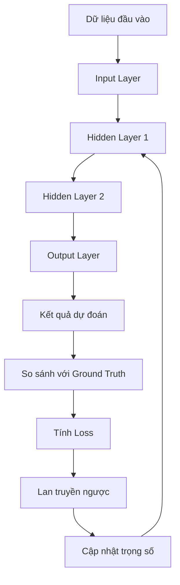

# I.Mạng Nơ-ron là gì?

**Mạng nơ-ron nhân tạo (Neural Network, NN)** là một mô hình tính toán trong lĩnh vực trí tuệ nhân tạo, lấy cảm hứng từ cấu trúc và cách thức hoạt động của bộ não con người. Giống như bộ não gồm hàng tỷ tế bào thần kinh (nơ-ron sinh học) liên kết với nhau để xử lý thông tin, mạng nơ-ron nhân tạo được xây dựng từ các nút (neurons) liên kết thành mạng lưới phức tạp, cho phép máy tính học hỏi và giải quyết các vấn đề thông qua dữ liệu.

---

## Nguyên lý hoạt động

Khi dữ liệu đầu vào được đưa vào mạng, nó sẽ truyền qua các lớp theo cơ chế **forward propagation** (truyền tiến), tạo ra dự đoán ở lớp đầu ra. Sau đó, mạng so sánh dự đoán này với kết quả thực tế để tính toán **sai số (loss)**. Dựa trên sai số này, thuật toán **backpropagation** (truyền ngược) sẽ điều chỉnh trọng số các kết nối nhằm giảm sai số trong các lần học tiếp theo.

Quá trình này được lặp đi lặp lại, giúp mạng học được các đặc điểm quan trọng của dữ liệu và cải thiện độ chính xác.

---

## Đặc điểm nổi bật

- **Khả năng học hỏi và tự điều chỉnh:** Mạng nơ-ron có thể tự động điều chỉnh trọng số dựa trên dữ liệu huấn luyện, từ đó học được các mẫu và quy luật phức tạp mà các mô hình truyền thống khó phát hiện.
- **Xử lý dữ liệu lớn, phi cấu trúc:** NN có thể xử lý hiệu quả nhiều loại dữ liệu như hình ảnh, âm thanh, văn bản, kể cả khi dữ liệu không có cấu trúc rõ ràng.
- **Tính chịu lỗi cao:** Khi một số phần tử trong mạng bị lỗi hoặc không hoạt động, mạng vẫn có thể tiếp tục hoạt động và cho ra kết quả tương đối chính xác.
- **Khả năng tổng quát hóa:** Sau khi được huấn luyện trên một tập dữ liệu đủ lớn và đa dạng, mạng nơ-ron có thể dự đoán tốt cho các dữ liệu mới chưa từng gặp.

---

## Ứng dụng thực tiễn

Mạng nơ-ron nhân tạo là nền tảng của nhiều công nghệ hiện đại như:

- Nhận diện hình ảnh
- Nhận diện giọng nói
- Dịch máy
- Dự báo tài chính
- Y tế
- Xe tự lái
- Và nhiều lĩnh vực khác trong trí tuệ nhân tạo và học sâu.

---

## Kết luận

Mạng nơ-ron nhân tạo là một hệ thống mô phỏng bộ não con người, có khả năng học hỏi từ dữ liệu và tự động tối ưu để giải quyết các bài toán phức tạp mà các phương pháp truyền thống khó tiếp cận.

# Vì sao cần dùng Mạng Nơ-ron (Neural Networks) thay vì các mô hình Machine Learning truyền thống?

Trong quá trình phát triển của lĩnh vực Trí tuệ nhân tạo (AI) và Machine Learning (ML), chúng ta đã chứng kiến sự chuyển dịch mạnh mẽ từ các mô hình học máy truyền thống sang các kiến trúc mạng nơ-ron sâu (Deep Neural Networks - DNNs). Mỗi loại mô hình đều có ưu và nhược điểm riêng, nhưng trong nhiều trường hợp, **mạng nơ-ron thể hiện khả năng vượt trội hơn rõ rệt**. Dưới đây là những lý do chính khiến chúng ta cần sử dụng mạng nơ-ron thay vì các mô hình truyền thống như hồi quy tuyến tính, cây quyết định, random forest, hay máy vector hỗ trợ (SVM):

---

##  1. Khả năng học các quan hệ phi tuyến tính phức tạp

Các mô hình truyền thống thường giả định rằng mối quan hệ giữa các biến đầu vào và đầu ra là tuyến tính hoặc gần tuyến tính (ví dụ: hồi quy tuyến tính), hoặc cần một số kỹ thuật biến đổi đặc trưng thủ công để mô hình hóa được quan hệ phi tuyến.

Trong khi đó, mạng nơ-ron – đặc biệt là các **mạng sâu (deep networks)** – có khả năng học **các quan hệ phi tuyến cực kỳ phức tạp** nhờ vào nhiều lớp ẩn và các hàm kích hoạt phi tuyến như ReLU, Sigmoid, Tanh,... Điều này giúp chúng phù hợp hơn với các bài toán có tính phức tạp cao như nhận dạng hình ảnh, xử lý ngôn ngữ tự nhiên và dự đoán chuỗi thời gian.

---

##  2. Tự động trích xuất đặc trưng (feature extraction)

Một điểm hạn chế lớn của các mô hình truyền thống là chúng yêu cầu người dùng phải **thiết kế đặc trưng (feature engineering)** thủ công – một quá trình tốn nhiều thời gian và công sức, và phụ thuộc nhiều vào kiến thức chuyên môn của domain.

Ngược lại, mạng nơ-ron – đặc biệt là **Convolutional Neural Networks (CNNs)** và **Recurrent Neural Networks (RNNs)** – có khả năng **tự động học ra các đặc trưng có ý nghĩa từ dữ liệu đầu vào** thông qua huấn luyện. Điều này giúp giảm phụ thuộc vào chuyên gia và cải thiện tính tổng quát của mô hình.

---

##  3. Hiệu suất vượt trội trên dữ liệu lớn và phức tạp

Các mạng nơ-ron hoạt động đặc biệt hiệu quả khi được huấn luyện trên **lượng dữ liệu lớn**. Khi có đủ dữ liệu, chúng thường **vượt xa các mô hình truyền thống về độ chính xác và khả năng tổng quát**, đặc biệt là trong các tác vụ như:

- Nhận diện hình ảnh (image recognition)
- Dịch máy (machine translation)
- Nhận dạng giọng nói (speech recognition)
- Chatbot và xử lý ngôn ngữ tự nhiên (NLP)

---

##  4. Linh hoạt và mở rộng tốt (Scalability & Flexibility)

Mạng nơ-ron có khả năng **mở rộng kiến trúc** rất tốt. Ta có thể dễ dàng thay đổi số lượng lớp, số lượng nút trong mỗi lớp, thêm dropout, batch normalization, attention,... để xây dựng các mô hình phù hợp với yêu cầu cụ thể của từng bài toán. Ngoài ra, chúng cũng thích hợp với việc huấn luyện phân tán trên nhiều GPU hoặc cluster.

---

##  5. Nhược điểm của mạng nơ-ron

- **Cần nhiều dữ liệu** để đạt hiệu quả cao
- **Yêu cầu tài nguyên tính toán lớn**, nhất là GPU/TPU
- **Khó giải thích hơn** so với mô hình tuyến tính hay cây quyết định (black-box model)
- Có nguy cơ **overfitting** nếu không được regularize đúng cách

---

## Khi nào nên chọn mạng nơ-ron?

- Dữ liệu đầu vào có tính **phi cấu trúc** (ví dụ: hình ảnh, văn bản, âm thanh)
- Bài toán có tính **phi tuyến mạnh**
- Có đủ tài nguyên tính toán và dữ liệu để huấn luyện mô hình sâu
- Bạn muốn xây dựng hệ thống **học đặc trưng tự động** và có khả năng tổng quát hóa tốt

---

##  Kết luận

Mạng nơ-ron không phải là "chìa khóa vạn năng", nhưng chúng là **công cụ cực kỳ mạnh mẽ** trong kho vũ khí của machine learning hiện đại. Việc lựa chọn sử dụng mạng nơ-ron hay mô hình truyền thống nên dựa trên đặc điểm của bài toán cụ thể, khả năng tính toán, cũng như mục tiêu cuối cùng của bạn.
# Tổng quan về MLP (Multilayer Perceptron)

Multilayer Perceptron (MLP) là một loại mạng nơ-ron nhân tạo cơ bản nhưng rất quan trọng, thường được sử dụng trong các bài toán phân loại và hồi quy. Dù là kiến trúc nền tảng, MLP vẫn là tiền đề cho các mạng phức tạp hơn như CNN và RNN.

---

## 1.  Các tầng (Layers) trong MLP

###  Input Layer (Lớp đầu vào)
- **Chức năng**: Nhận dữ liệu đầu vào từ thế giới thực hoặc tập dữ liệu huấn luyện.
- **Cấu trúc**: Mỗi neuron đại diện cho một đặc trưng (feature) của dữ liệu.
- **Đặc điểm**:
  - Không thực hiện tính toán.
  - Truyền thẳng dữ liệu sang lớp tiếp theo.

###  Hidden Layers (Lớp ẩn)
- **Chức năng**: Trích xuất đặc trưng và biểu diễn các mối quan hệ phức tạp trong dữ liệu.
- **Cấu trúc**:
  - Một hoặc nhiều lớp ẩn.
  - Mỗi neuron trong lớp ẩn nhận toàn bộ đầu ra từ lớp trước (fully connected).
- **Công thức tính toán**:
  ```math
  z = W \cdot x + b \\
  a = f(z)
  ```
- **Ghi chú**:
- Số lượng lớp ẩn và số neuron trong mỗi lớp ảnh hưởng trực tiếp đến khả năng học của mô hình.
- Quá ít neuron: mô hình **underfitting**.
- Quá nhiều neuron: dễ bị **overfitting**.

###  Output Layer (Lớp đầu ra)
- **Chức năng**: Trả về kết quả dự đoán của mô hình.
- **Số lượng neuron** phụ thuộc vào bài toán:
- Phân loại nhị phân: 1 neuron + sigmoid.
- Phân loại đa lớp: `n` neuron + softmax.
- Hồi quy: 1 neuron + hàm tuyến tính.

---

## 2.  Trọng số (Weights) và Bias

- **Trọng số (Weights)**:
- Là các tham số chính mà mô hình học được trong quá trình huấn luyện.
- Xác định mức độ ảnh hưởng của một neuron đến neuron kế tiếp.

- **Bias**:
- Là một hằng số được cộng thêm vào đầu vào của mỗi neuron (trừ input layer).
- Cho phép mô hình dịch chuyển hàm kích hoạt để tăng khả năng biểu diễn.

---

## 3.  Hàm kích hoạt (Activation Functions)

- **Vai trò**: Tạo tính phi tuyến cho mô hình. Nếu không có activation, MLP chỉ là một mô hình tuyến tính, không đủ để học các quan hệ phức tạp.

- **Các loại phổ biến**:

| Tên hàm     | Công thức                             | Đặc điểm                                  |
|-------------|----------------------------------------|--------------------------------------------|
| Sigmoid     | `f(x) = 1 / (1 + exp(-x))`             | Dễ gây vanishing gradient.                 |
| Tanh        | `f(x) = (exp(x) - exp(-x)) / (exp(x) + exp(-x))` | Zero-centered nhưng vẫn có vanishing. |
| ReLU        | `f(x) = max(0, x)`                     | Phổ biến, hiệu quả, đơn giản.              |
| Leaky ReLU  | `f(x) = max(αx, x)`                    | Khắc phục dead neuron.                     |
| Softmax     | `f(x_i) = exp(x_i) / Σ(exp(x_j))`      | Dùng trong classification nhiều lớp.       |

---

## 4.  Forward Pass (Lan truyền tiến)

- **Mục tiêu**: Dự đoán đầu ra từ đầu vào.
- **Cách hoạt động**:
- Tính tổng có trọng số + bias tại mỗi neuron.
- Áp dụng hàm kích hoạt.
- Truyền kết quả sang lớp kế tiếp.
- **Diễn ra từ** lớp đầu vào → lớp ẩn → lớp đầu ra.

---

## 5.  Backward Pass (Lan truyền ngược)

- **Mục tiêu**: Tính toán sai số (loss) và điều chỉnh trọng số để tối ưu mô hình.
- **Các bước**:
1. Tính loss: ví dụ, `MSE`, `Cross-Entropy`,...
2. Tính đạo hàm loss theo từng trọng số (gradient).
3. Cập nhật trọng số bằng thuật toán tối ưu:
   - **Gradient Descent**
   - **Stochastic Gradient Descent (SGD)**
   - **Adam**, **RMSProp**, v.v.

- **Áp dụng**: Quy tắc chuỗi (Chain Rule) trong đạo hàm để truyền lỗi từ output → input.

---

## 6.  Toàn cảnh quá trình học của MLP


- Forward pass: Dữ liệu được truyền từ input qua các lớp ẩn đến output để  tạo ra dự đoán.

- Loss: Kết quả được so sánh với nhãn thực tế để tính toán sai số.

- Backward pass: Tính gradient và cập nhật trọng số để mô hình học từ sai số.
## 7.  Ứng dụng MLP trong DevOps / MLOps

| Ứng dụng                         | Mô tả |
|----------------------------------|-------|
| **CI/CD cho mô hình AI**        | Tự động hóa quá trình huấn luyện và triển khai thông qua pipeline (GitHub Actions, Jenkins). |
| **Triển khai mô hình**          | Dùng các framework như FastAPI, TorchServe hoặc KServe (Kubeflow) để triển khai mô hình dưới dạng API. |
| **Theo dõi mô hình (Monitoring)** | Sử dụng Prometheus + Grafana để giám sát các chỉ số như loss, accuracy, throughput, latency,... |
| **Quản lý phiên bản**           | Dùng MLflow hoặc DVC để quản lý tập dữ liệu, trọng số mô hình, thí nghiệm và các version. |
| **Tự động hóa retraining**      | Thiết lập trigger (VD: accuracy giảm) để huấn luyện lại mô hình khi cần thiết. |

---

##  Tổng kết

MLP là nền tảng cho nhiều mô hình học sâu hiện đại, như CNN, RNN,...

-  **Dễ hiểu, dễ triển khai**, nhưng vẫn đủ mạnh cho nhiều bài toán classification và regression.
-  Khi kết hợp với **DevOps (MLOps)**, mô hình MLP có thể:
  - Được **huấn luyện liên tục**.
  - Được **triển khai linh hoạt** trên môi trường cloud hoặc on-premise.
  - Được **giám sát và cập nhật** để duy trì độ chính xác cao trong môi trường thực tế.

>  *"MLP không chỉ là mạng nơ-ron đơn giản, mà còn là bước khởi đầu cho hành trình chinh phục thế giới AI một cách bài bản và chuyên nghiệp."*


##  Quá trình Huấn luyện MLP bằng Gradient Descent và Backpropagation

Trong mạng nơ-ron nhiều lớp (MLP), quá trình huấn luyện mô hình bao gồm hai giai đoạn chính: **lan truyền tiến (forward pass)** để tính toán đầu ra, và **lan truyền ngược (backward pass)** để cập nhật trọng số, giúp mô hình học từ dữ liệu đầu vào. Dưới đây là chi tiết về hai thành phần cốt lõi trong quá trình này: **Gradient Descent** và **Backpropagation**.

---

### 1.  Gradient Descent (Thuật toán tối ưu)

**Gradient Descent** là một thuật toán tối ưu phổ biến được sử dụng để tìm giá trị tối ưu của các tham số như **trọng số (weights)** và **bias** trong mạng nơ-ron. Mục tiêu là **giảm thiểu hàm mất mát (loss function)** bằng cách cập nhật các tham số theo hướng ngược lại với đạo hàm của hàm mất mát.

####  Công thức cập nhật tham số:

$$
w_{new} = w_{old} - \eta \cdot \frac{\partial \text{Loss}}{\partial w}
$$

Trong đó:
- \( w_{old} \): trọng số hiện tại
- \( w_{new} \): trọng số sau khi cập nhật
- \( \eta \): **learning rate** (tốc độ học), quy định bước nhảy mỗi lần cập nhật
- \( \frac{\partial \text{Loss}}{\partial w} \): đạo hàm (gradient) của hàm mất mát theo trọng số

> Việc lựa chọn learning rate phù hợp rất quan trọng. Nếu quá nhỏ, mô hình học chậm; nếu quá lớn, có thể gây dao động hoặc không hội tụ.

---

### 2.  Backpropagation (Lan truyền ngược)

**Backpropagation** là thuật toán được sử dụng để tính **gradient của hàm mất mát đối với từng tham số** của mạng. Thuật toán này hoạt động theo nguyên lý **quy tắc chuỗi (chain rule)** trong đạo hàm, giúp lan truyền sai số từ đầu ra về các lớp trước đó trong mạng.

#### 💡 Các bước trong backpropagation:

1. **Tính toán sai số tại lớp đầu ra**:
   - Dựa vào sự khác biệt giữa **dự đoán của mô hình** và **giá trị nhãn thực tế**.

2. **Lan truyền sai số ngược về các lớp ẩn**:
   - Áp dụng quy tắc chuỗi để tính gradient của hàm mất mát với từng trọng số và bias tại mỗi lớp.

3. **Cập nhật trọng số và bias**:
   - Dùng các gradient thu được để cập nhật tham số theo thuật toán gradient descent.

4. **Lặp lại quá trình**:
   - Các bước trên được lặp lại cho nhiều vòng (epochs) cho đến khi:
     - Hàm mất mát đạt giá trị tối thiểu.
     - Hoặc mô hình thỏa mãn một tiêu chí dừng (VD: loss không thay đổi nhiều giữa các vòng lặp).

---

###  Tóm tắt

- MLP là mạng nơ-ron có **nhiều lớp ẩn**, trong đó mỗi lớp gồm các **neuron kết nối đầy đủ**, có trọng số, bias và sử dụng **hàm kích hoạt phi tuyến (non-linear activation)** để học các mối quan hệ phức tạp trong dữ liệu.
- Quá trình huấn luyện gồm:
  - **Forward pass**: Truyền dữ liệu đầu vào qua mạng để tạo ra đầu ra dự đoán.
  - **Backward pass (Backpropagation)**: Tính toán sai số và cập nhật trọng số để mô hình cải thiện dự đoán.

>  Kết hợp gradient descent và backpropagation giúp MLP **học được các biểu diễn nội tại của dữ liệu**, từ đó đưa ra dự đoán chính xác hơn theo thời gian.

---

 *"Backpropagation không chỉ là thuật toán, mà là nền tảng giúp mạng nơ-ron học hỏi từ sai lầm — một bước tiến quan trọng đưa trí tuệ nhân tạo trở nên khả dụng trong thực tế."*


##  PyTorch Cơ Bản

PyTorch là một thư viện mã nguồn mở hỗ trợ **deep learning** linh hoạt và dễ dùng, đặc biệt phù hợp cho nghiên cứu và triển khai mô hình. Dưới đây là các thành phần cơ bản bạn cần nắm:

---
## Bảng So Sánh Các Thành Phần Cơ Bản Trong PyTorch

| Thành Phần      | Mục Đích                         | Ví Dụ Cơ Bản                       | Ghi Chú                      |
|-----------------|---------------------------------|----------------------------------|------------------------------|
| **Tensor**      | Lưu trữ dữ liệu đa chiều        | `torch.tensor([[1,2],[3,4]])`    | Tương tự `ndarray` trong NumPy, hỗ trợ GPU |
| **Dataset**     | Đại diện cho tập dữ liệu         | Kế thừa `torch.utils.data.Dataset` và định nghĩa `__getitem__`, `__len__` | Dùng để truy xuất dữ liệu theo index |
| **DataLoader**  | Chia dữ liệu thành batch, shuffle | `DataLoader(dataset, batch_size=32, shuffle=True)` | Hỗ trợ nạp dữ liệu song song, tăng hiệu quả training |
| **nn.Module**   | Định nghĩa mô hình mạng nơ-ron  | Kế thừa và định nghĩa hàm `forward()` | Cơ sở để xây dựng các lớp mạng |
| **Loss Function** | Đánh giá sai số của mô hình     | `nn.MSELoss()`                   | Có nhiều loại: MSE, CrossEntropy,... |
| **Optimizer**   | Cập nhật trọng số dựa trên gradient | `optim.SGD(model.parameters(), lr=0.01)` | Các thuật toán phổ biến: SGD, Adam,... |
| **Autograd**    | Tính gradient tự động           | `tensor.backward()`              | Tự động xây dựng đồ thị tính toán động |

##  Các Kiến Trúc Mạng Nơ-ron Phổ Biến

---

### 1. CNN – Convolutional Neural Network

####  Cấu trúc cơ bản:
- **Convolution Layer**: 
  - Thực hiện phép toán tích chập giữa bộ lọc (filter/kernel) và ảnh đầu vào để trích xuất đặc trưng cục bộ (local features).
- **Pooling Layer**:
  - Giảm kích thước không gian của dữ liệu (thường dùng MaxPooling hoặc AveragePooling), giúp giảm số lượng tham số và tính toán, đồng thời tăng tính kháng nhiễu.
- **Flatten**:
  - Chuyển đổi ma trận đa chiều thành vector một chiều để kết nối với các lớp fully connected.
- **Fully Connected (Dense) Layer**:
  - Các lớp kết nối đầy đủ để tổng hợp và phân loại đặc trưng trích xuất được.

####  Ứng dụng trong xử lý ảnh:
- Phân loại hình ảnh (Image Classification)
- Phát hiện đối tượng (Object Detection)
- Nhận dạng khuôn mặt, phân đoạn ảnh (Image Segmentation), v.v.

---

### 2. RNN & LSTM

####  RNN (Recurrent Neural Network):

- Mạng hồi tiếp cho phép mô hình nhớ thông tin từ các bước thời gian trước đó, thích hợp cho dữ liệu chuỗi.
- **Vấn đề Gradient Vanishing**:
  - Khi chuỗi dài, gradient truyền ngược qua nhiều bước dễ bị giảm rất nhỏ, gây khó khăn trong việc học các phụ thuộc dài hạn.

####  LSTM (Long Short-Term Memory):

- Là biến thể của RNN được thiết kế để giải quyết vấn đề vanishing gradient.
- Sử dụng các **cổng (gates)** như input gate, forget gate, và output gate để kiểm soát luồng thông tin, giúp mạng nhớ hoặc quên thông tin một cách hiệu quả.

####  Ứng dụng trong xử lý chuỗi:
- Xử lý ngôn ngữ tự nhiên (Natural Language Processing - NLP): dịch máy, phân tích cảm xúc, tạo văn bản.
- Dữ liệu thời gian (Time-series): dự báo tài chính, dự báo thời tiết, nhận dạng giọng nói.

---

> *"CNN giúp ta hiểu hình ảnh qua các đặc trưng không gian, còn RNN/LSTM mở ra khả năng phân tích dữ liệu có trình tự và thời gian, mở rộng sức mạnh của AI vào nhiều lĩnh vực phức tạp."*
